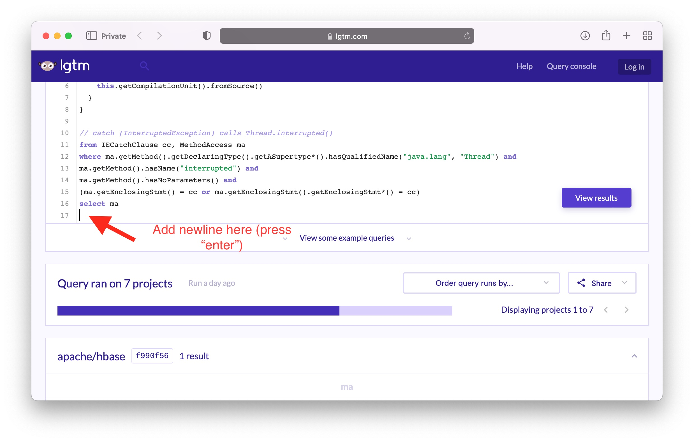
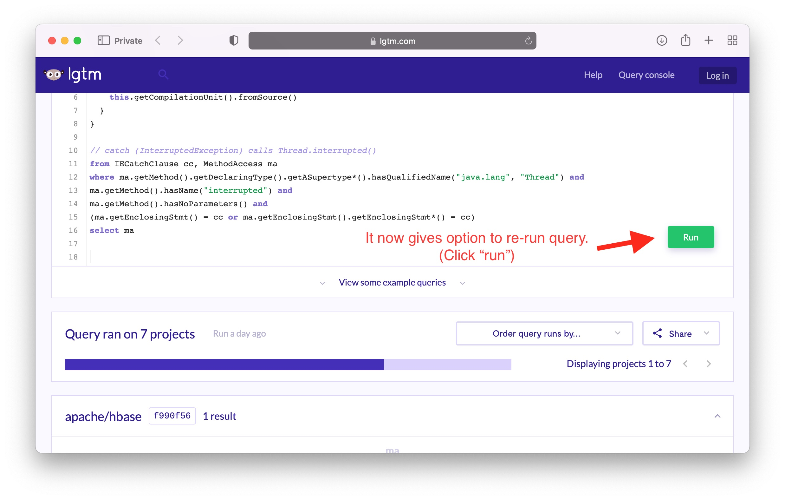
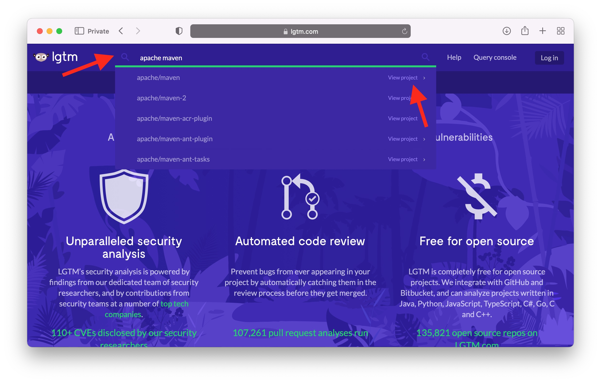
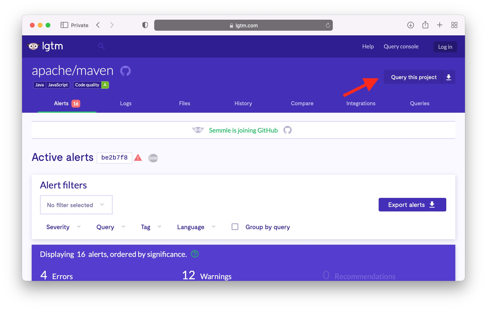
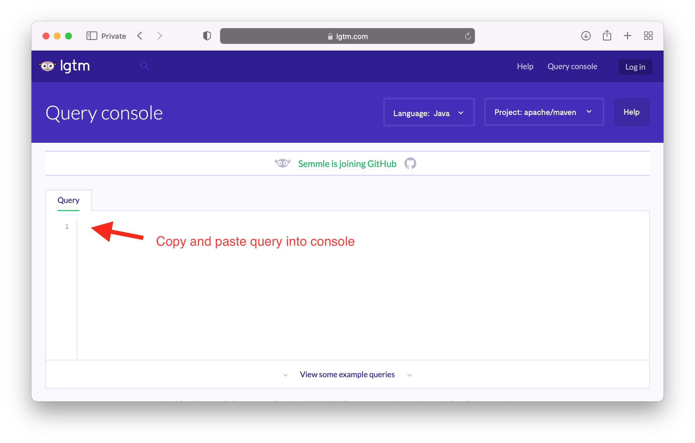

# Artifact overview
Contained in this repo are artifacts related to Submission #118 in OSDI '22, "Cancellation in Systems: An Empirical Study of Task Cancellation Patterns and Failures".

There are three parts to the artifact: cancel feature requests dataset, cancel issue requests dataset, and queries used to detect cancel-antipatterns.

## 1. Cancel feature requests dataset 
Contained in file `CancelFeatureRequests.xlsx`.

This dataset is the foundation of section 4, "Why Do Applications Cancel Tasks" and the summary corresponds to Table 3 of the submitted paper.

## 2. Cancel issue requests dataset
Contained in file `CancelIssues.xlsx`.

These issues form the basis of the discussion in section 5, "Root Causes of Cancel-Related Bugs" and summaries of the data correspond to Tables 2,4,5 and 6 of the submitted paper.

## 3. Queries for cancel anti-pattern detection
Located in codeql-queries/ directory. These queries are used to detect anti-patterns in studied applications (described in section 7 of the paper, "Task Cancel Anti-Patterns"). The results from running the queries are populated in table 7. 

### Overview: using CodeQL

CodeQL is the static-analysis tool we used to detect instances of antipatterns in the applications we studied. 

The tool works by generating a database of structured source code information (such as AST, data flow, and control flow information) from source code files. Users can then issue custom queries on this database. ([CodeQL intro](https://codeql.github.com/docs/codeql-overview/about-codeql/))

Queries can be issued via command line on manually built databases, or users can also use an online interface (called [LGTM](https://lgtm.com)) which queries pre-built application databases. 

We favor the browser interface to run queries, for ease-of-use and performance reasons. In one case where a pre-built database is not available (SOLR application) we require use of the command line.

### Directions to reproduce results

The online tool uses pre-built databases, which will change as the app or CodeQL version gets updated. Since the latest version is different from our submitted version (only querying the latest is possible) we include expected results for latest versions of all apps in the file `AntiPatternsUpdated.xlsx`.

#### Reproduction via online tool (all apps excluding SOLR)

We provide the queries from the paper in the codeql-queries/ directory of this repo.

As a shortcut to reproduce results, we have included links to our previous query runs here. To re-run a query at a link provided, the user can trigger a "dummy" recompilation (by entering a new line at the end of the query) and then clicking the "Run" button.





Antipattern 1 - Unhandled IE in loop (Java): [query](https://lgtm.com/query/4502635833131002770/)

Antipattern 2 - API misuse (Java): [query](https://lgtm.com/query/6993141721663402382/)

Antipattern 3 - Uncanceled child tasks (Java): [query](https://lgtm.com/query/6339895077683761249/)

Antipattern 4 - Ignored tokens (C#): [query](https://lgtm.com/query/6530142182538842937/)

Antipattern 4b - Ignored tokens (CodeRush simulated resul, C#t): [query](https://lgtm.com/query/2963154777123929711/)

Antipattern 5 - Tokens not passed (C#): [query](https://lgtm.com/query/2497434787279115793/)

The number of antipatterns found for each app are used to populate Table 7.

#### Reproduction via command line (SOLR only)

The online tool does not have a pre-built database for SOLR, so the app must be queried using the command line.

We have packaged the command line tool and scripts into a docker container (requires docker installed locally: see [here](https://docs.docker.com/engine/))

To run:
```
docker run -it --rm whoisutsav/codeql-solr
cd /usr/local/codeql_scripts
./repro_solr_results.sh
```


#### Issuing a query against a different app
The queries we provided can be used against different apps.


*If a popular open source application*

LGTM integrates with github, so many popular open-source applications will be automatically queryable.

1. Navigate to http://lgtm.com

2. Click the search icon at the top of the page and search for your project (searching here for "apache maven"). Click "view project"



3. On the project page, click "Query this project"



4. Copy and paste the query from the relevant file into the console. After the query compiles click "Run"




*If a new application*

If querying a new application, you can use the command line tool.

1. Install the command line tool: [Getting started with CodeQL CLI](https://codeql.github.com/docs/codeql-cli/getting-started-with-the-codeql-cli/)

2. Build the CodeQL database: [Creating CodeQL databases](https://codeql.github.com/docs/codeql-cli/creating-codeql-databases/)

3. Query the database (can provide a query file from the repo as an argument): [CodeQL query run](https://codeql.github.com/docs/codeql-cli/manual/query-run/)


